# 🔬 Data Science Agent

An intelligent multi-agent system that leverages insights from 647 Kaggle competitions to automatically generate and execute data science solutions.

## 🚀 What is this?

This is an AI-powered data science assistant that:
- **Searches 647 Kaggle competitions** to find similar problems and winning techniques
- **Generates complete Python code** including data loading, analysis, and visualization
- **Executes code safely** with user approval (local) or in sandbox (remote)
- **Auto-fixes errors** and iterates to improve solutions
- **Creates beautiful visualizations** with descriptive names and proper organization

## 🎯 Key Features

### 🤖 Multi-Agent Workflow

```mermaid
flowchart TB
    subgraph Input
        User["👤 User Input<br/>Problem + Dataset"]
    end
    
    subgraph "Multi-Agent System"
        Orchestrator["🧠 Orchestrator Agent<br/>Plans & Coordinates"]
        Research["🔍 Research Agent<br/>Searches 647 Kaggle Competitions"]
        Coding["💻 Coding Agent<br/>Generates Complete Solutions"]
        
        Orchestrator -->|"Need insights?"| Research
        Research -->|"Similar problems found"| Orchestrator
        Orchestrator -->|"Generate code"| Coding
        Coding -->|"Code ready"| Orchestrator
    end
    
    subgraph "Knowledge Base"
        VectorDB["📚 Vector Database<br/>647 Kaggle Competitions<br/>Embeddings + Solutions"]
    end
    
    subgraph "Execution"
        LocalExec["🖥️ Local Execution<br/>With User Approval"]
        RemoteExec["☁️ Remote Execution<br/>Riza Sandbox"]
    end
    
    subgraph Output
        Results["📊 Results<br/>• Analysis<br/>• Visualizations<br/>• Models<br/>• Metrics"]
    end
    
    User --> Orchestrator
    Research --> VectorDB
    Coding --> LocalExec
    Coding --> RemoteExec
    LocalExec --> Results
    RemoteExec --> Results
    
    Orchestrator -->|"Errors?"| Coding
    
    style User fill:#e1f5fe,stroke:#01579b,stroke-width:2px
    style Orchestrator fill:#ffebee,stroke:#b71c1c,stroke-width:2px
    style Research fill:#e8f5e9,stroke:#1b5e20,stroke-width:2px
    style Coding fill:#e3f2fd,stroke:#0d47a1,stroke-width:2px
    style VectorDB fill:#f3e5f5,stroke:#4a148c,stroke-width:2px
    style Results fill:#fff3e0,stroke:#e65100,stroke-width:2px
```


### User Interface


The Streamlit web interface provides an intuitive way to interact with the multi-agent system. Users can upload datasets, describe their data science problems in natural language, select models for each agent, and monitor the workflow in real-time with detailed logging and progress updates.


### 🎨 Initial Release (v0.1)

1. **📸 Automatic Visualizations**
   - Embeds generated plots directly in summaries
   - Smart detection and labeling of visualization types
   - Proper markdown image references with descriptions

2. **📊 Metrics Extraction**
   - Automatically extracts accuracy, precision, recall, F1, RMSE from output
   - Formats metrics with percentages for clarity
   - Displays in dedicated Performance Metrics section

3. **🧹 Structured Summaries**
   - Filters warnings and file paths from key findings
   - Excludes empty fields from Kaggle insights
   - Shows only meaningful summary content

4. **🔧 Multi-Agent Architecture**
   - Work directory coordination between agents
   - Organized file structure for all outputs
   - Comprehensive error handling and debugging

## 📖 How It Works (Pseudo-Code)

```python
# High-Level Agentic Workflow

def solve_data_science_problem(problem, dataset):
    """
    Multi-agent workflow for automated data science
    """
    # Initialize agents with custom models
    orchestrator = OrchestratorAgent(model="gemini-2.5-pro")
    research = ResearchAgent(model="gpt-4o", vector_db=kaggle_db)
    coding = CodingAgent(model="claude-4-sonnet")
    
    # Create work directory for this run
    work_dir = create_timestamped_directory()
    state = {"problem": problem, "dataset": dataset, "work_dir": work_dir}
    
    # Main workflow loop (max iterations to prevent infinite loops)
    for iteration in range(MAX_ITERATIONS):
        
        # Step 1: Orchestrator decides next action
        decision = await orchestrator.plan(state)
        
        if decision == "research":
            # Step 2a: Research similar Kaggle competitions
            queries = generate_search_queries(problem, dataset)
            insights = await research.search_kaggle(queries)
            techniques = extract_winning_techniques(insights)
            state.update({"insights": insights, "techniques": techniques})
            
        elif decision == "coding":
            # Step 2b: Generate complete solution code
            code = await coding.generate_solution(
                problem=problem,
                dataset_path=f"{work_dir}/inputs/{dataset.name}",
                insights=state.get("insights", []),
                previous_errors=state.get("errors", [])
            )
            
            # Step 3: Execute code with safety checks
            if execution_mode == "local":
                user_approved = await get_user_approval(code)
                if not user_approved:
                    return "User cancelled execution"
            
            results = await execute_code(code, work_dir)
            
            # Step 4: Handle results or errors
            if results.success:
                state.update({
                    "code": code,
                    "output": results.output,
                    "visualizations": find_generated_images(work_dir)
                })
            else:
                state["errors"].append(results.error)
                # Loop continues for auto-fix attempt
                
        elif decision == "end":
            # Step 5: Generate final summary with visualizations
            summary = create_enhanced_summary(state)
            save_all_results(work_dir, summary, code, visualizations)
            return summary
    
    return "Max iterations reached"
```

## 🛠️ Installation & Setup

### Prerequisites
- Python 3.8+
- API keys for at least one LLM provider

### 1. Clone & Install

```bash
git clone <repository-url>
cd open_data_science_agent
pip install -r requirements.txt
```

### 2. Set Up API Keys

Create `credentials.txt` in the parent directory:
```
OPENAI_API_KEY=sk-xxx
ANTHROPIC_API_KEY=sk-xxx
DEEPSEEK_API_KEY=xxx
GEMINI_API_KEY=xxx
RIZA_API_KEY=xxx  # Optional for remote execution
```

### 3. Run the Application

```bash
PYTHONPATH=. python run.py --debug --multi-agent
```

You can add `--auto-approve` to automatically approve code execution without user interaction.

## 💡 Usage Examples

### Web Interface (Recommended)
1. Select models for each agent (or use defaults)
2. Upload your CSV dataset
3. Describe your problem in natural language
4. Watch agents collaborate in real-time
5. Review and approve generated code
6. Get results with visualizations and metrics

### Example Problems to Try
- "Build a classifier to predict customer churn"
- "Create a regression model for house prices"
- "Analyze this dataset and find interesting patterns"
- "Train a random forest and show feature importance"

## 📁 Project Structure

```
open_data_science_agent/
├── src/                         # Core source code
│   ├── agents/                  # Multi-agent implementations
│   │   ├── orchestrator.py      # Workflow coordination
│   │   ├── research_agent.py    # Kaggle search
│   │   └── coding_agent.py      # Code generation
│   ├── tools/                   # Agent tools
│   │   ├── vector_search.py     # Vector DB search
│   │   └── code_executor.py     # Code execution
│   ├── state.py                 # State management
│   ├── graph.py                 # LangGraph workflow
│   ├── prompts.py               # Agent prompts
│   └── llm_utils.py             # LLM management
├── app/                         # Web interface
│   └── streamlit_app.py         # Main UI
└── data/                        # Kaggle embeddings
```

## 🔧 Configuration

### Model Selection
- **Quality**: GPT-4o + Claude Sonnet
- **Speed**: GPT-4o-mini + Gemini Flash  
- **Cost**: DeepSeek across all agents

### Execution Modes
- **Local** (default): Safer, requires approval
- **Remote**: Automatic via Riza sandbox

## 🤝 Contributing

We welcome contributions! Please:
1. Fork the repository
2. Create a feature branch
3. Add tests and documentation
4. Submit a pull request

## 📝 TODO / Future Enhancements

- [ ] **Remote Execution** - Run code in Riza sandbox (implemented but not tested yet)
- [ ] **Expand Kaggle Competition Coverage** - Add more recent competitions 
- [ ] **Evaluation Agent** - Dedicated agent for model evaluation and validation
- [ ] **Parallel Code Execution** - Run multiple experiments simultaneously
- [ ] **Interactive Dashboard** - Real-time metrics and visualization updates

## 🙏 Acknowledgments

This project builds upon and is inspired by several amazing open-source projects:

### Core Dependencies
- **[LangChain](https://github.com/langchain-ai/langchain)** - The foundation for our multi-agent orchestration and LLM integrations
- **[LangGraph](https://github.com/langchain-ai/langgraph)** - Powers our stateful agent workflows and decision routing
- **[Streamlit](https://streamlit.io/)** - Enables our beautiful and interactive web interface

### Inspiration & Architecture
- **[open_deep_research](https://github.com/langchain-ai/open_deep_research)** by LangChain - This project is heavily inspired by and adapted from the open_deep_research architecture. We've adapted their multi-agent patterns and workflow designs for the specific domain of data science automation.

### Special Thanks
- The **Kaggle Community** for sharing solutions and insights that make our knowledge base possible
- **OpenAI**, **Anthropic**, **Google**, and **DeepSeek** for their powerful language models
- All contributors and users who help improve this project

## 📄 License

MIT License - see LICENSE file for details.
